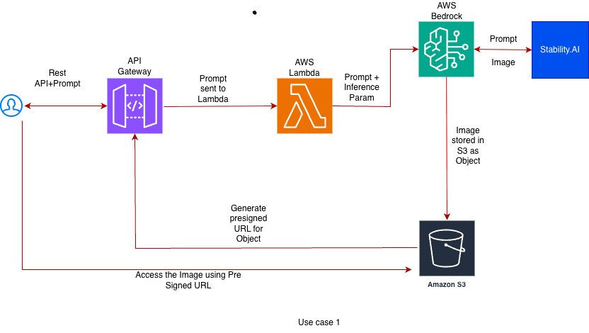

# AI Movie Poster Generator (AWS Bedrock)

A serverless application that generates AI-powered movie posters using **Amazon Bedrock (Stable Diffusion)**.  
The system is built using **AWS Lambda**, **Amazon S3**, and **API Gateway**, following security best practices.

---

## Overview

This project demonstrates how to build an end-to-end AI image generation pipeline on AWS:

- A user submits a text prompt
- AWS Lambda invokes an image generation model via Amazon Bedrock
- The generated image is stored securely in Amazon S3
- A pre-signed URL is returned for temporary access to the image

This repository is intended for **demonstration and learning purposes**.

---

## Architecture

### Flow
1. User sends a request via API Gateway
2. API Gateway triggers an AWS Lambda function
3. Lambda invokes Amazon Bedrock (Stable Diffusion model)
4. Generated image is stored in a private S3 bucket
5. Lambda returns a pre-signed S3 URL to the user

---

## AWS Services Used

- **AWS Lambda** – Serverless compute for image generation logic
- **Amazon Bedrock** – AI model inference (Stable Diffusion)
- **Amazon S3** – Secure image storage
- **Amazon API Gateway** – HTTP endpoint for user requests
- **AWS IAM** – Role-based access control

---

## Security Considerations

- No AWS credentials are stored in the code or repository
- AWS Lambda uses an **IAM execution role**
- S3 bucket is private
- Images are accessed only via **time-limited pre-signed URLs**
- IAM permissions follow the **principle of least privilege**

---

## Repository Structure

